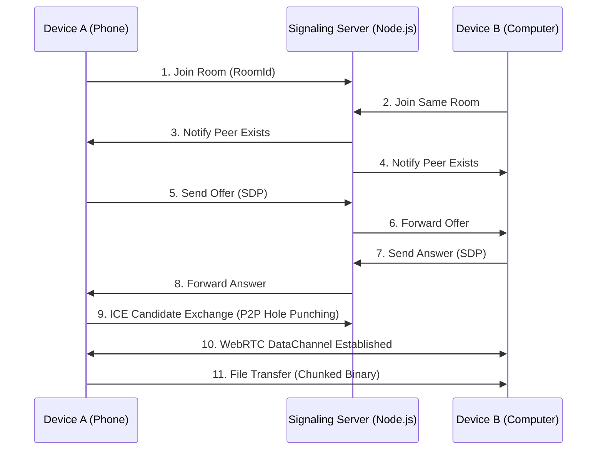

# 📁 AirDrop Web - Cross-Platform File Transfer Assistant

A zero-configuration, peer-to-peer file transfer tool based on WebRTC. No app installation required - just open in any browser to quickly transfer files between phones, computers, and tablets.


## ✨ Features

- 🔒 **End-to-End Encrypted**: Uses WebRTC DataChannel - files never pass through the server
- 📱 **Cross-Platform**: Works in any modern browser (Chrome / Safari / Edge / Firefox)
- 🚀 **Lightning Fast**: Direct LAN connection maximizes local bandwidth
- 💡 **Zero Configuration**: Open the page, enter room code, connect - done in 3 steps
- 📦 **Large File Support**: Automatic chunking, supports GB-sized files
- 📊 **Progress Tracking**: Real-time send/receive progress display
- 🎨 **Responsive Design**: Perfectly adapts to mobile portrait and desktop widescreen

## 🛠️ Tech Stack

| Component      | Technology                     |
|----------------|--------------------------------|
| Frontend       | HTML5 + CSS3 + Vanilla JS      |
| Real-time Comm | WebRTC (DataChannel)           |
| Signaling      | Node.js + WebSocket (ws)       |
| NAT Traversal  | Google STUN Server             |
| File Handling  | File API + Blob + ArrayBuffer  |

## 📦 Project Structure

```
airdrop-web/
├── README.md              # Project documentation
├── package.json           # Dependencies and scripts
├── server.js              # WebSocket signaling server
├── main.js                # Electron main process (optional)
├── public/
│   ├── index.html         # Main page
│   ├── css/
│   │   └── style.css      # Styles
│   └── js/
│       └── app.js         # Frontend logic
└── dist/                  # Build output

```

## 🚀 Quick Start

### Requirements

- Node.js (v14 or higher)
- Modern browser (WebRTC support)

### Installation & Running

1. **Clone or download the project**

```bash
git clone https://github.com/Tianshang301/AirDrop-Web.git
cd AirDrop-Web
```

2. **Install dependencies**

```bash
npm install
```

3. **Start the signaling server**

```bash
npm start
```

The server runs at `http://localhost:3000` by default, with the access address shown in console.

4. **Access from devices on the same LAN**
- Connect phone and computer to the same Wi-Fi
- On computer, visit `http://localhost:3000` (or local IP like `http://192.168.1.100:3000`)
- On phone, scan QR code or enter computer IP with port

5. **Start transferring**
- Enter the same **room code** on both devices (e.g., `123456`)
- Click "Connect" and wait for pairing (status shows "Connected")
- Select a file to send, the other device will automatically receive and prompt download

> 💡 **Tip**: If connection fails, check that firewall allows port 3000, or try a different room code.

## 🧠 How It Works



- The **signaling server** only handles connection metadata exchange (SDP & ICE candidates), no file data passes through.
- Once connected, files transfer directly peer-to-peer - speed depends only on LAN performance.

## 📱 Screenshots

| Connection Screen                                                  | File Transfer                                                     |
|:------------------------------------------------------------------:|:----------------------------------------------------------------:|
|  |  |

## ⚙️ Configuration

### Modify STUN Server

Edit the `configuration` object in `public/index.html`:

```javascript
const configuration = {
  iceServers: [
    { urls: 'stun:stun.l.google.com:19302' },
    // Add your own STUN/TURN servers here
  ]
};
```

### Change Port

Modify in `server.js` or via environment variable:

```javascript
const PORT = process.env.PORT || 3000;
```

## 🐛 FAQ

**Q: Always shows "Waiting for peer"?**  
A: Make sure both devices use exactly the same room code and the signaling server is running. Try refreshing the page.

**Q: Phone and computer can't connect?**  
A: Verify they're on the same LAN (same Wi-Fi or subnet). Some public Wi-Fi networks isolate devices - try using mobile hotspot instead.

**Q: Large file transfer fails?**  
A: Browser memory limits may cause issues. This tool chunks files (16KB/chunk), but for files over 2GB, consider specialized tools. You can increase chunk size by modifying `CHUNK_SIZE`.

**Q: Does it support folder transfer?**  
A: Current version only supports single files. Select multiple files to send separately.

**Q: Does it support internet remote transfer?**  
A: Default is LAN only. For public network transfer, you need a TURN server (not included), otherwise P2P hole punching will likely fail.

## 📄 License

MIT License. Free to use, modify, and distribute with attribution.

## 🤝 Contributing

Issues and Pull Requests welcome! If you find this useful, please give a ⭐Star!

---

## 📝 Appendix: Core Code Snippets

### Frontend - WebRTC Connection (Key Logic)

```javascript
// Create PeerConnection
const pc = new RTCPeerConnection(configuration);

// Listen for ICE candidates
pc.onicecandidate = (event) => {
  if (event.candidate) {
    sendSignaling({ type: 'candidate', candidate: event.candidate });
  }
};

// Create DataChannel (initiator)
const dataChannel = pc.createDataChannel('fileTransfer');
setupDataChannel(dataChannel);

// Receive remote DataChannel (responder)
pc.ondatachannel = (event) => {
  setupDataChannel(event.channel);
};
```

### Backend - Room Signaling Handler

```javascript
wss.on('connection', (ws) => {
  ws.on('message', (message) => {
    const data = JSON.parse(message);
    switch (data.type) {
      case 'join':
        // Join room logic, forward offer/answer/candidate
        break;
      case 'offer':
      case 'answer':
      case 'candidate':
        // Forward to other clients in room
        break;
    }
  });
});
```

---

## 🎉 Get Started!

Connect your phone and computer to the same network, open the page, and enjoy AirDrop-like file transfer convenience!
