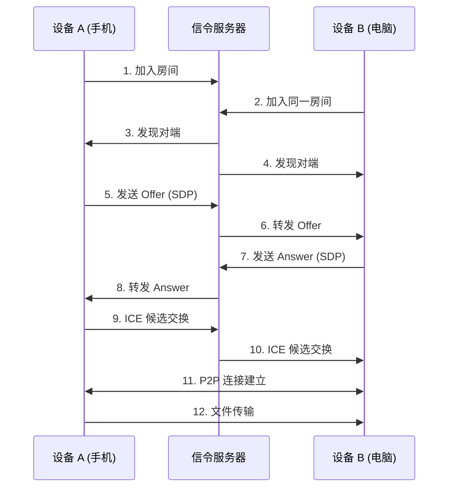

# 📁 AirDrop Web

基于 WebRTC 的浏览器端点对点文件传输工具。无需安装任何应用、无需数据线，打开网页即可在任意设备间传输文件。


## ✨ 特性

- 🔒 **端对端加密** - 通过 WebRTC DataChannel 直接传输，文件不过服务器
- 📱 **全平台支持** - 任何现代浏览器均可使用（Chrome / Safari / Edge / Firefox）
- 🚀 **局域网极速** - 直连利用本地带宽，传输速度更快
- 💡 **零配置** - 三步完成：打开网页 → 输入房间号 → 连接
- 📦 **支持大文件** - 分块传输，支持 GB 级文件
- 📊 **实时进度** - 显示发送/接收进度
- 🎨 **响应式布局** - 适配手机竖屏和电脑宽屏

## 🛠️ 技术栈

| 组件       | 技术选型                      |
|-----------|-------------------------------|
| 前端       | HTML5 + CSS3 + Vanilla JS     |
| 实时通信   | WebRTC (DataChannel)          |
| 信令服务   | Node.js + WebSocket (ws)      |
| NAT 穿透   | Google STUN Server             |
| 文件处理   | File API + Blob + ArrayBuffer |

## 📁 项目结构

```
airdrop-web/
├── README.md           # 英文说明
├── README-zh.md        # 本文件
├── package.json        # 依赖配置
├── server.js           # WebSocket 信令服务器
├── public/
│   ├── index.html      # 主页面
│   ├── css/
│   │   └── style.css  # 样式文件
│   └── js/
│       └── app.js     # 前端逻辑
└── dist/               # 构建输出
```

## 🚀 快速开始

### 环境要求

- Node.js v14+
- 支持 WebRTC 的现代浏览器

### 运行

```bash
git clone https://github.com/Tianshang301/AirDrop-Web.git
cd AirDrop-Web
npm install
npm start
```

服务器启动于 `http://localhost:3000`。

### 连接设备

1. 手机和电脑连接同一 Wi-Fi
2. 在两个设备上打开应用 URL
3. 输入相同的**房间号**（如 `123456`）
4. 点击"连接" → 开始传输文件！

> 💡 **提示**：无法连接？请检查防火墙是否允许 3000 端口，或尝试更换房间号。

## 🧠 工作原理



信令服务器仅负责交换连接元数据（SDP/ICE），文件数据直接在设备间传输。

## 📱 截图

| 连接界面 | 文件传输 |
|:--------:|:--------:|
|  |  |

## ⚙️ 配置

### STUN 服务器

编辑 `public/index.html` 中的 `configuration`：

```javascript
const configuration = {
  iceServers: [
    { urls: 'stun:stun.l.google.com:19302' },
  ]
};
```

### 端口

修改 `server.js`：

```javascript
const PORT = process.env.PORT || 3000;
```

## ❓ 常见问题

**Q: 一直显示"等待配对"？**  
A: 确保两设备输入的房间号完全一致，信令服务器正常运行。刷新页面重试。

**Q: 手机和电脑无法连接？**  
A: 确认在同一局域网。部分公共 Wi-Fi 会隔离设备，可尝试使用手机热点。

**Q: 大文件传输失败？**  
A: 浏览器内存限制可能导致问题。工具已采用分块传输（16KB/块），超过 2GB 的文件建议使用专业工具。

**Q: 支持传输文件夹吗？**  
A: 当前版本仅支持单文件，可多次选择发送。

**Q: 支持互联网远程传输吗？**  
A: 默认仅限局域网。公网传输需要 TURN 服务器（未包含）。

## 📄 开源协议

MIT License

## 🤝 贡献

欢迎提交 Issue 和 Pull Request！觉得有用请给个 ⭐！

---

## 🔧 附录：核心代码

### 前端 - WebRTC 初始化

```javascript
const pc = new RTCPeerConnection(configuration);

pc.onicecandidate = (event) => {
  if (event.candidate) {
    sendSignaling({ type: 'candidate', candidate: event.candidate });
  }
};

const dataChannel = pc.createDataChannel('fileTransfer');
setupDataChannel(dataChannel);

pc.ondatachannel = (event) => {
  setupDataChannel(event.channel);
};
```

### 后端 - 信令处理

```javascript
wss.on('connection', (ws) => {
  ws.on('message', (message) => {
    const data = JSON.parse(message);
    switch (data.type) {
      case 'join':
        // 将客户端加入房间
        break;
      case 'offer':
      case 'answer':
      case 'candidate':
        // 转发给同房间的其他客户端
        break;
    }
  });
});
```

---

## 🎉 开始使用

在两个设备上打开网页，即刻体验便捷的文件传输！
