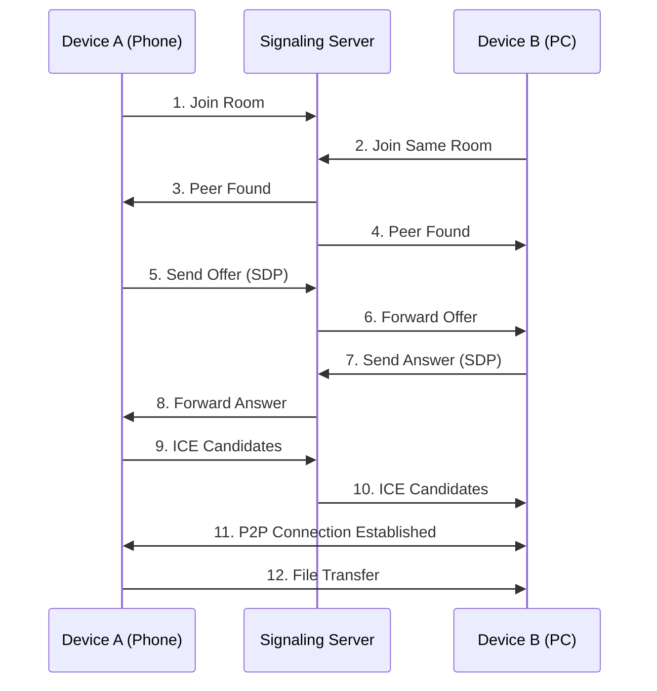

# README.md
- en [English](README.md)
- zh_CN [简体中文](readme/README.zh_CN.md)

---

# 📁 AirDrop Web

A browser-based, peer-to-peer file transfer tool powered by WebRTC. Transfer files between any devices—no apps, no cables, just open and share.


## ✨ Features

- 🔒 **P2P Encrypted** - Files transfer directly between devices via WebRTC DataChannel
- 📱 **Works Everywhere** - Any modern browser (Chrome, Safari, Edge, Firefox)
- 🚀 **LAN Speed** - Direct connection utilizes full local bandwidth
- 💡 **Zero Setup** - 3 steps: open page → enter room code → connect
- 📦 **Any File Size** - Chunked transfer supports GB-sized files
- 📊 **Live Progress** - Real-time transfer progress tracking
- 🎨 **Responsive** - Adapts seamlessly to mobile and desktop screens

## 🛠️ Tech Stack

| Component      | Technology                     |
|----------------|--------------------------------|
| Frontend       | HTML5 + CSS3 + Vanilla JS      |
| Real-time Comm | WebRTC (DataChannel)           |
| Signaling      | Node.js + WebSocket (ws)       |
| NAT Traversal  | Google STUN Server             |
| File Handling  | File API + Blob + ArrayBuffer  |

## 📁 Project Structure

```
airdrop-web/
├── README.md                  # This file
├── README-zh_CN.md            # 中文说明
├── package.json               # Dependencies
├── server.js                  # WebSocket signaling server
├── public/
│   ├── index.html            # Main page
│   ├── css/
│   │   └── style.css         # Styles
│   └── js/
│       └── app.js            # Frontend logic
└── dist/                     # Build output
```

## 🚀 Quick Start

### Requirements

- Node.js v14+
- Modern browser with WebRTC support

### Run

```bash
git clone https://github.com/Tianshang301/AirDrop-Web.git
cd AirDrop-Web
npm install
npm start
```

Server starts at `http://localhost:3000`.

### Connect Devices

1. Connect phone and computer to the same Wi-Fi
2. Open the app URL on both devices
3. Enter the same **room code** on both (e.g., `123456`)
4. Click "Connect" → transfer files!

> 💡 **Tip**: Can't connect? Check firewall settings for port 3000, or try a different room code.

## 🧠 How It Works



The signaling server only exchanges connection metadata (SDP/ICE). All file data flows directly peer-to-peer.

## 📱 Screenshots

| Connection | Transfer |
|:----------:|:--------:|
|  |  |

## ⚙️ Configuration

### STUN Server

Edit `configuration` in `public/index.html`:

```javascript
const configuration = {
  iceServers: [
    { urls: 'stun:stun.l.google.com:19302' },
  ]
};
```

### Port

Modify in `server.js`:

```javascript
const PORT = process.env.PORT || 3000;
```

## ❓ FAQ

**Q: Stuck on "Waiting for peer"?**  
A: Ensure both devices use the same room code and the server is running. Refresh and retry.

**Q: Can't connect phone and PC?**  
A: Verify both are on the same network. Some public Wi-Fi networks isolate devices—try mobile hotspot.

**Q: Large file transfer fails?**  
A: Browser memory limits may apply. This tool chunks files (16KB chunks). For files >2GB, consider specialized tools.

**Q: Folder transfer?**  
A: Single files only in current version. Send multiple files separately.

**Q: Remote/internet transfer?**  
A: LAN only by default. Internet transfer requires a TURN server (not included).

## 📄 License

MIT License

## 🤝 Contributing

Issues and PRs welcome! Give a ⭐ if you find this useful.

---

## 🔧 Appendix: Core Code

### Frontend - WebRTC Setup

```javascript
const pc = new RTCPeerConnection(configuration);

pc.onicecandidate = (event) => {
  if (event.candidate) {
    sendSignaling({ type: 'candidate', candidate: event.candidate });
  }
};

const dataChannel = pc.createDataChannel('fileTransfer');
setupDataChannel(dataChannel);

pc.ondatachannel = (event) => {
  setupDataChannel(event.channel);
};
```

### Backend - Signaling

```javascript
wss.on('connection', (ws) => {
  ws.on('message', (message) => {
    const data = JSON.parse(message);
    switch (data.type) {
      case 'join':
        // Add client to room
        break;
      case 'offer':
      case 'answer':
      case 'candidate':
        // Forward to room peers
        break;
    }
  });
});
```

---

## 🎉 Get Started

Open the page on two devices, share files instantly!
