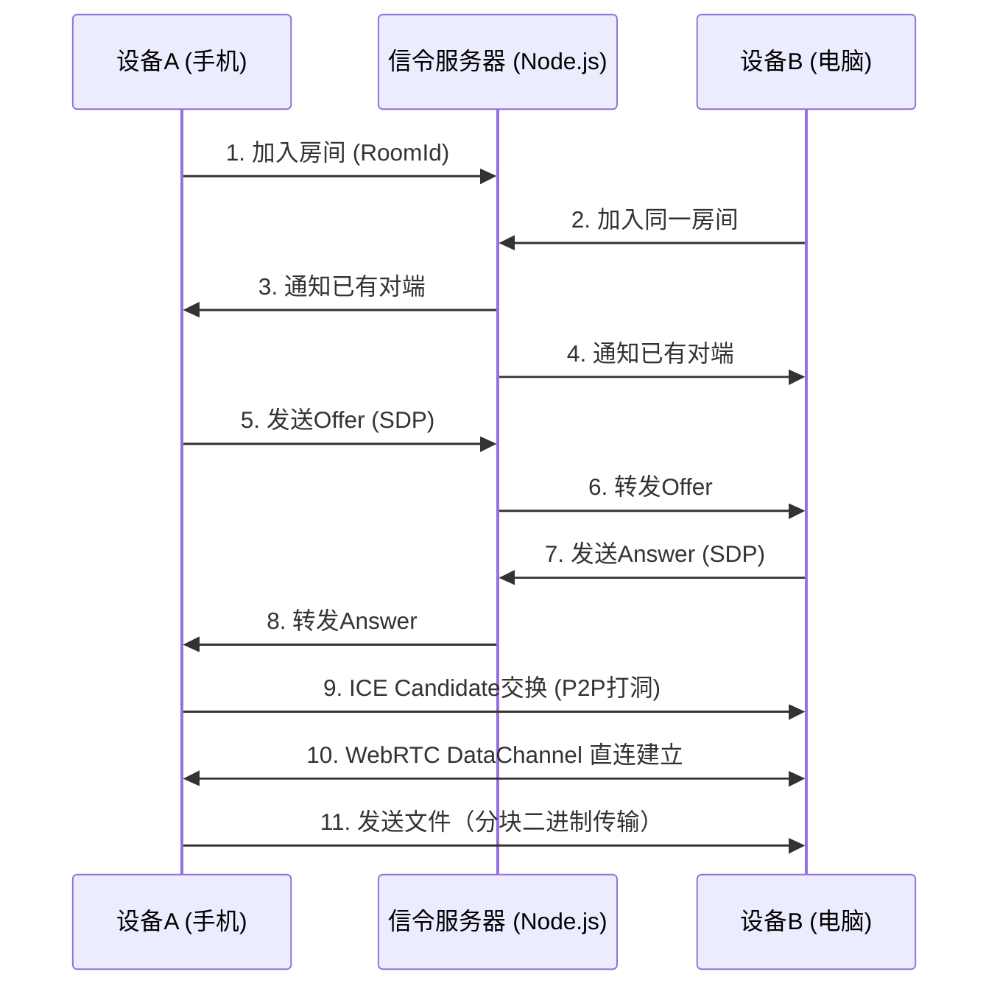

这是您所需的“手机电脑文件互传”网页端小程序的完整项目代码。它基于WebRTC技术，允许同一局域网下的设备通过浏览器直接、安全地传输文件。

```markdown
# 📁 AirDrop Web - 跨平台文件传输助手

一个基于WebRTC的零配置、点对点文件传输工具，无需安装任何APP，仅需浏览器即可在手机、电脑、平板等设备间快速传输文件。


## ✨ 特性

- 🔒 **点对点加密**：使用WebRTC DataChannel，数据不经服务器中转，保障隐私安全
- 📱 **全平台支持**：任何现代浏览器（Chrome / Safari / Edge / Firefox）均可使用
- 🚀 **极速传输**：局域网内直连，充分利用本地带宽
- 💡 **零配置**：打开网页、输入房间号、连接，三步完成
- 📦 **大文件支持**：自动分块传输，支持GB级文件
- 📊 **传输进度**：实时显示发送/接收进度
- 🎨 **响应式设计**：完美适配手机竖屏与电脑宽屏

## 🛠️ 技术栈

| 组件          | 技术选型                     |
| ------------- | ---------------------------- |
| 前端          | HTML5 + CSS3 + Vanilla JS    |
| 实时通信      | WebRTC (DataChannel)         |
| 信令服务      | Node.js + WebSocket (ws库)   |
| NAT穿透       | Google STUN 服务器            |
| 文件处理      | File API + Blob + ArrayBuffer |

## 📦 项目结构

```

airdrop-web/
├── README.md              # 项目文档
├── package.json           # 依赖及脚本
├── server.js            # WebSocket信令服务器
├── main.js              # Electron 主进程 (可选)
├── public/
│   ├── index.html       # 主页面
│   ├── css/
│   │   └── style.css   # 样式文件
│   └── js/
│       └── app.js      # 前端逻辑
└── dist/                # 构建输出目录

```

airdrop-web/
├── README.md          # 项目文档
├── package.json       # 依赖及脚本
├── server.js          # WebSocket信令服务器
└── public/
    └── index.html     # 前端应用（包含样式与逻辑）

```

## 🚀 快速开始

### 环境要求

- Node.js (v14 或更高版本)
- 现代浏览器（支持WebRTC）

### 安装与运行

1. **克隆或下载项目代码**

```bash
git clone https://github.com/yourname/airdrop-web.git
cd airdrop-web
```

2. **安装依赖**

```bash
npm install
```

3. **启动信令服务器**

```bash
npm start
```

服务器默认运行在 `http://localhost:3000`，控制台会输出访问地址。

4. **在同一局域网下访问**
- 手机与电脑连接同一个Wi-Fi
- 电脑访问 `http://localhost:3000`（或本机IP，如 `http://192.168.1.100:3000`）
- 手机浏览器扫码或直接输入电脑IP地址加端口号
5. **开始传输**
- 在任意设备上输入相同的**房间号**（例如 `123456`）
- 点击“连接”按钮，等待配对成功（状态变为“已连接”）
- 选择文件并发送，另一设备会自动接收并提示下载

> 💡 **提示**：如果无法连接，请检查防火墙是否允许3000端口，或尝试更换房间号重新连接。

## 🧠 工作原理



- **信令服务器**仅负责交换连接元数据（SDP与ICE候选），不参与文件传输。
- 建立连接后，文件数据直接在设备之间传输，速度仅取决于局域网性能。

## 📱 使用截图

| 连接界面                                                        | 文件传输                                                           |
|:-----------------------------------------------------------:|:--------------------------------------------------------------:|
|  |  |

## ⚙️ 配置说明

### 修改STUN服务器

编辑 `public/index.html` 中的 `configuration` 对象：

```javascript
const configuration = {
  iceServers: [
    { urls: 'stun:stun.l.google.com:19302' },
    // 可添加自己的STUN/TURN服务器
  ]
};
```

### 修改端口

在 `server.js` 或启动命令中修改：

```javascript
const PORT = process.env.PORT || 3000;
```

## 🐛 常见问题

**Q: 连接一直显示“等待配对”？**  
A: 确保两个设备输入的房间号完全一致，且信令服务器正常运行。刷新页面后重试。

**Q: 手机和电脑无法建立连接？**  
A: 请检查两者是否在同一个局域网（同一Wi-Fi或网段）。部分公共Wi-Fi可能隔离设备间通信，建议使用手机热点测试。

**Q: 传输大文件时失败？**  
A: 浏览器内存限制可能导致问题。本工具已将文件分块（16KB/块），但若文件超过2GB，建议使用专业工具。可尝试增加分块大小（修改 `CHUNK_SIZE` 常量）。

**Q: 支持传输文件夹吗？**  
A: 当前版本仅支持单文件。可多次选择文件发送。

**Q: 是否支持互联网远程传输？**  
A: 默认仅限局域网。如需公网传输，需要部署TURN服务器（本项目未包含），否则P2P打洞大概率失败。

## 📄 开源协议

MIT License。自由使用、修改、分发，但需保留版权声明。

## 🤝 贡献

欢迎提交Issue与Pull Request。若您觉得有用，请给个⭐Star支持！

---

## 📝 附录：核心代码片段

### 前端 - 建立WebRTC连接（关键逻辑）

```javascript
// 创建PeerConnection
const pc = new RTCPeerConnection(configuration);

// 监听ICE候选
pc.onicecandidate = (event) => {
  if (event.candidate) {
    sendSignaling({ type: 'candidate', candidate: event.candidate });
  }
};

// 创建DataChannel（发起方）
const dataChannel = pc.createDataChannel('fileTransfer');
setupDataChannel(dataChannel);

// 接收远端DataChannel（应答方）
pc.ondatachannel = (event) => {
  setupDataChannel(event.channel);
};
```

### 后端 - 房间信令处理

```javascript
wss.on('connection', (ws) => {
  ws.on('message', (message) => {
    const data = JSON.parse(message);
    switch (data.type) {
      case 'join':
        // 加入房间逻辑，转发offer/answer/candidate
        break;
      case 'offer':
      case 'answer':
      case 'candidate':
        // 转发给同房间的其他客户端
        break;
    }
  });
});
```

---

## 🎉 开始使用吧！

将手机和电脑连接至同一网络，打开网页，体验如同AirDrop般的便捷文件传输！
```
